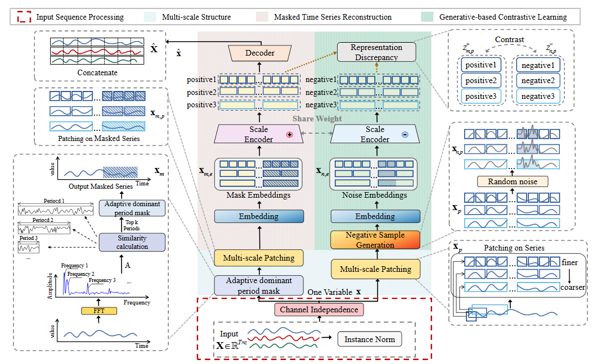

# T-Mino
**Adaptive Multi-scale Reconstructive Contrasting for Time Series Early Anomaly Detection**


Time series anomaly detection is typically used to identify data that significantly deviate from the normal where faults or failures may happen, which is critical for ensuring the stability and safety of systems. However, existing approaches mainly focus on time series post anomaly detection, and struggle to detect anomalies at an early stage. The research on early anomaly detection to enable in-time preventive maintenance remains relatively limited, as early anomaly signals often begin as quite slight deviations from the normal and have varying durations, and the lack of labeled data further complicates model training. To address these challenges, we propose a novel early anomaly detection framework, T-Mino. Specifically, T-Mino employs a multi-scale structure and adaptive dominant period masking to capture the early anomaly durations across different variables. Additionally, T-Mino introduces a dual-branch mechanism combining reconstructive and contrastive learning. The contrastive branch leverages a controlled generative strategy to produce diverse hard negative samples, enhancing the ability of the model to distinguish between early anomalies and normal. The reconstruction branch complements this by evaluating the magnitude of fluctuations to ensure sensitivity to subtle changes. Finally, evaluations were conducted on eight benchmark datasets from various domains. In both early anomaly detection and post anomaly detection tasks, T-Mino outperforms existing state-of-the-art methods.

- **Overall**: TMino leverages an innovative framework based on adaptive multi-scale reconstructive contrasting to enhance early anomaly detection in time series.

- **Architecture**: T-Mino employs a multi-scale structure and adaptive dominant period masking to capture the early anomaly durations across different variables. 

- **Architecture**: T-Mino introduces a dual-branch mechanism combining reconstructive and contrastive learning. The contrastive branch leverages a controlled generative strategy to produce diverse hard negative samples, enhancing the ability of the model to distinguish between early anomalies and normal. The reconstruction branch complements this by evaluating the magnitude of fluctuations to ensure sensitivity to subtle changes.

- **Performance & Justification**:  TMino evaluates eight real datasets from different fields. In both early anomaly detection and post anomaly detection tasks, T-Mino outperforms existing state-of-the-art methods.


||
|:--:| 
| *Figure 2. The workflow of the TMino framework.* |


## Main Result
We compare model with eleven baseline methods to evaluate TMino performance in early and post anomaly detection tasks. Extensive experiments show that TMino achieves the best or comparable performance on benchmark datasets compared to various state-of-the-art algorithms.

||
|:--:| 
| *Table 1. For the early anomaly detection task, overall results on real-world datasets.* |


## Code Description
There are ten files/folders in the source.

- data_factory: The preprocessing folder/file. All datasets preprocessing codes are here.
- dataset: The dataset folder.
- main_prediction.py: The main python file. You can adjustment all parameters in there.
- metrics: There is the evaluation metrics code folder, which includes affiliation precision/recall pair, and other common metrics.
- model: TMino model folder. The details can be corresponding to paper’s Section 3.
- scripts: All datasets and ablation experiments scripts. You can reproduce the experiment results as get start shown.
- solver.py: Another python file. The training, validation, and testing processing are all in there. 
- utils: Other functions for data processing and model building.
- requirements.txt: Python packages needed to run this repo.


## Get Start
1. Install Python 3.9, PyTorch = 1.13.
2. Download data. You can obtain all benchmarks from [Baidu Cloud](https://pan.baidu.com/s/1FnJv0FR7UFsAp5Jmqp4Ewg?pwd=wmav). password: wmav. 
3. Train and evaluate. We provide the experiment scripts of all benchmarks under the folder ```./scripts```. You can reproduce the experiment results as follows:

```bash
bash ./scripts/MSL.sh
```

